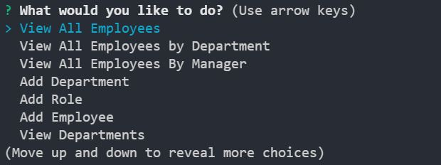
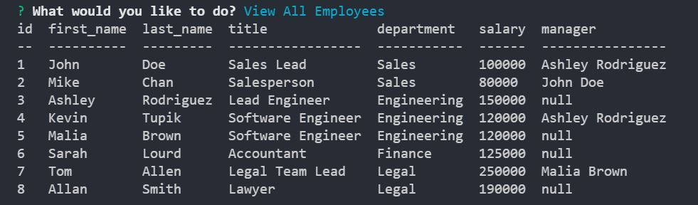

# Employee-Tracker

The purpose of this project is to build a Content Management System that is manipulated through the terminal using inquirer. The project consisted in two parts. The first one was based around designing the database that stored all the information of our application. The second part was the script that interacted with the database and allows the user to store new, update existing and withdraw information.

The database has the following structure
```
department
    * id (PK)
    * name - VARCHAR (30)

role
	* id (PK)
	* title - VARCHAR (30) NOT NULL
	* salary - DECIMAL (10,4) NOT NULL
    * department_id (FK) - INT(10) NOT NULL

employee
	* id (PK)
    * first_name - VARCHAR (30) NOT NULL
    * last_name - VARCHAR (30) NOT NULL
    * role_id (FK) - INT (10) NOT NULL
    * manager_id (FK) - INT (10) DEFAULT NULL
```

## Technologies

This project was developed using:
* JavaScript
* Node.js
* Inquirer
* Console Table
* Mysql

## Setup

To run this project you need to have Node.js, all the dependencies required for this project installed, you need to have your mysql server settings in the index.js file and you need to copy, paste and execute the schema and seed content in you mysql workbench. Before running the code, make sure you have the required dependencies already installed by running the "npm install" command. Once we are all set up you can run the scrip by typing "npm start" in the terminal.

## Mock Up
|   |    | 
| :-------------: | :-------------: |
|Employee Tracker - Main Menu|Employee Tracker - View All Employees|

## Walkthrough video
* https://drive.google.com/file/d/10cAEA1BwWClKswVGXNqalGzsctRHC5Ny/view